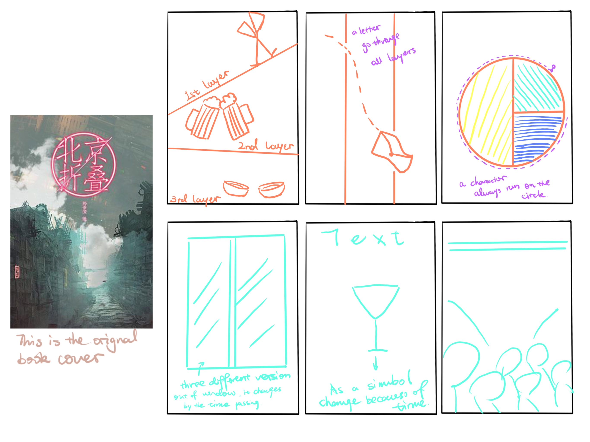
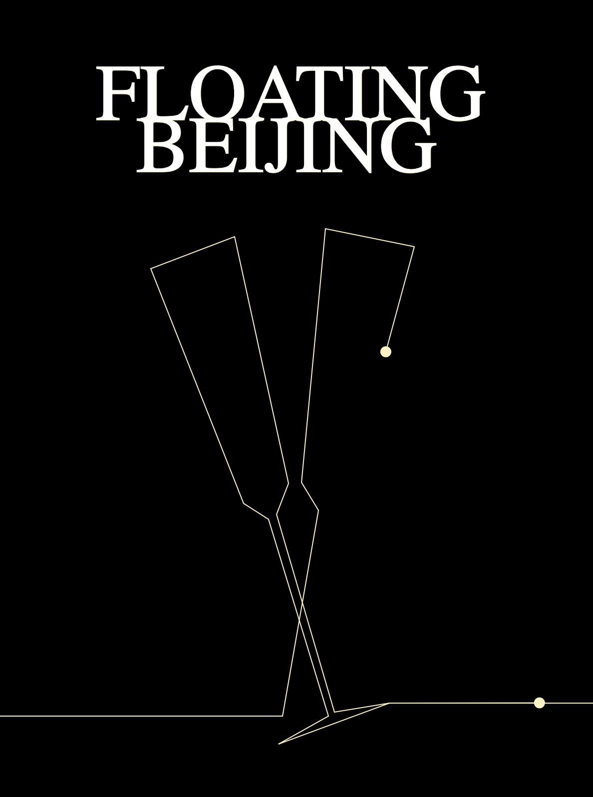
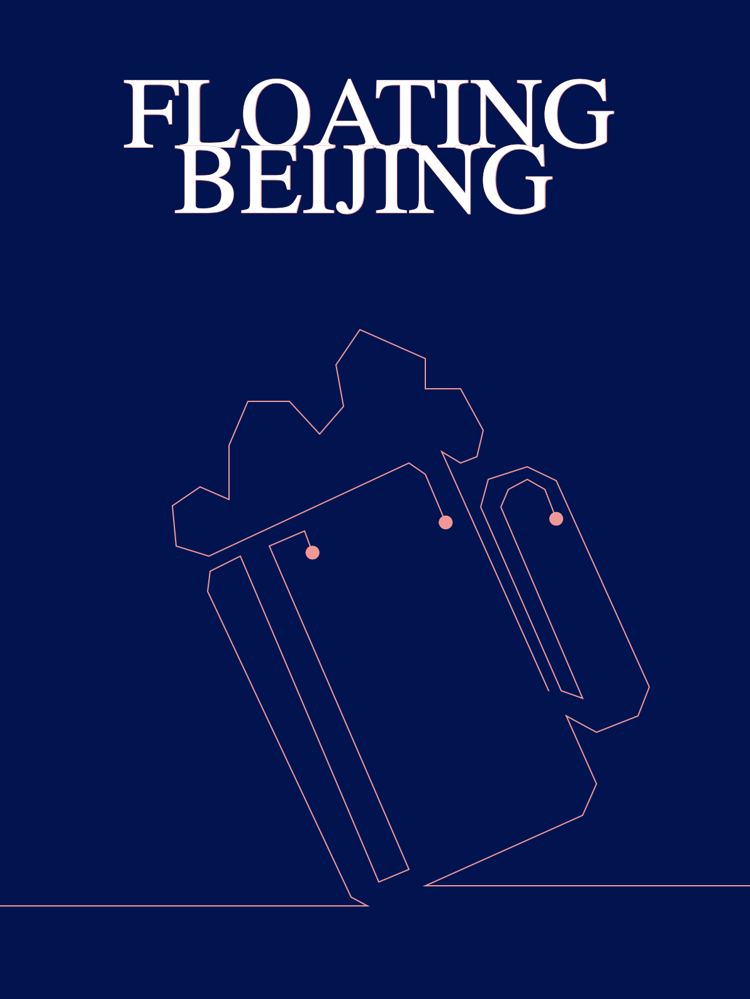

# p5.js Template

This is a README file that can be used to describe and document your assignment.

Markdown Cheatsheet (from [https://www.markdownguide.org/cheat-sheet/](https://www.markdownguide.org/cheat-sheet/)):

---
---

PART1:
"Folding Beijing"

This is a science fiction novel that tells the story of a future Beijing divided into three spatial dimensions based on social class. The protagonist, Lao Dao, a garbage collector living in the third space, risks his life to deliver messages between the three spaces to ensure that his adopted daughter can receive an education. During this process, he witnesses the stories of young women from the upper class who marry into wealth and young university students from the middle class who strive to change their destinies through education. He is also rescued by a benevolent person who moved from the third space to the first space, and after enduring many hardships, he finally returns to his home.

In this book, three worlds are metaphorical representations of the upper class, middle class, and lower class. As the spaces fold, time also folds. Life in the first space lasts from early morning at 6 AM to the following day's 6 AM, after which it enters a dormant state and shifts to the second and third spaces. Life in the second space lasts from 6 AM the following day to 10 PM at night, and life in the third space lasts from 10 PM to the next morning at 6 AM.

I will consider depicting the concept of the three spaces on my cover because these spaces differ significantly in terms of resources, wealth, and living conditions, and I will attempt to incorporate the unique characteristics of each space. In terms of character representation, I may choose to draw objects or features that are representative of the plot and showcase them on the cover.

Since the novel itself has a unique concept of time, I will try to incorporate this temporal concept into the design and interactivity of the cover.

The purpose of a book cover is to visualize a part of the book's information. It serves to attract readers visually while conveying some basic information about the book's style, tone, and content.

(I also upload my sketch as JPG at Brightspace.)

Image on repo:  

PART2:

After numerous attempts and searching through tutorials, I have finally managed to solve the issue of making the graph move in accordance with the path I had drawn. This is a significant breakthrough for me since, in reality, my poster requires the presentation of numerous graphics and lines. However, as I delved deeper into this project, I encountered some new challenges.

To enhance the visual appeal, I began by implementing a glowing effect for the moving graphics, leaving a colorful trail behind that conceals the underlying path. This approach ensures that the poster viewers won't perceive the actual path but instead see the figures through the mesmerizing trailing effect.

In another endeavor, I experimented with changing the pattern, color, path, and the shape of the moving figure every time the mouse was clicked. This dynamic approach aligns with the stylistic elements found in the three different spaces presented in the book.

PART3:

I completed the programming for the mid-project this week and, after a conversation with the professor, resolved some of the issues that arose last week.

There are a total of three different patterns, which means three separate paths. By altering and dividing the drawing paths, the patterns take on a more dynamic appearance. Simultaneously, in line with the feature of each space being connected through pipelines in the book, the same pattern is drawn from multiple directions, resembling different individuals arriving in the space through various paths. (In the story, it's not allowed to freely move between spaces, and if someone from a lower level is found secretly coming to an upper level, they are sentenced to death.) In the book, the three spaces switch in a cyclic manner, so the paths in the artwork are also drawn in a cyclic fashion.

In the book, these three spaces switch in relation to time. In my work, the interactivity primarily conveys the concept of "switching." Therefore, viewers can achieve the goal of switching patterns, spaces, colors, and routes by clicking on the screen.

Reference:  

Image on repo:  

Image on repo:  

Image on repo:  

